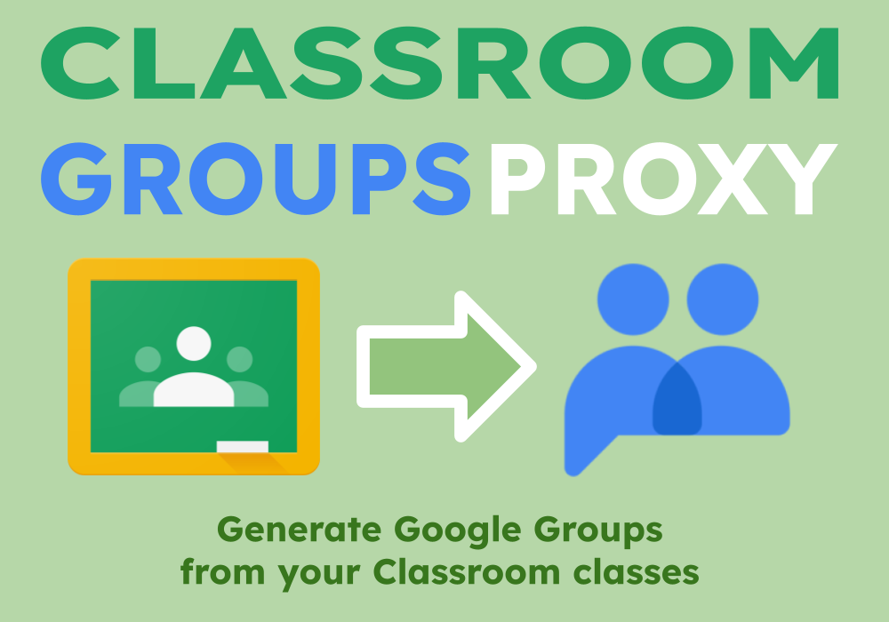
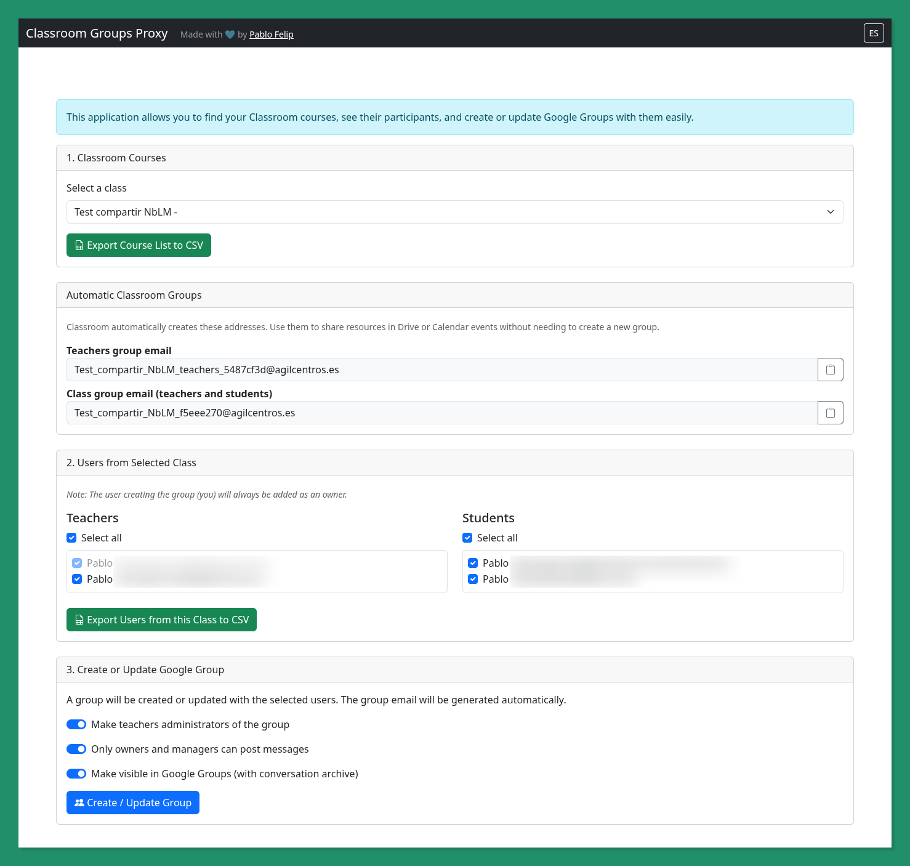
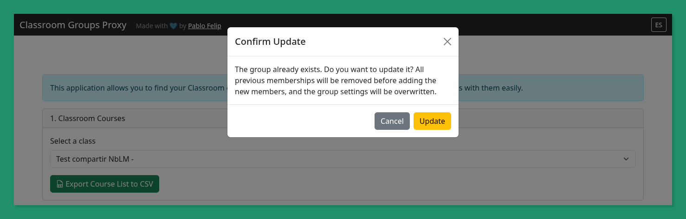
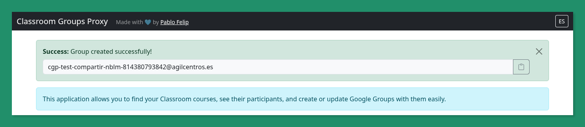
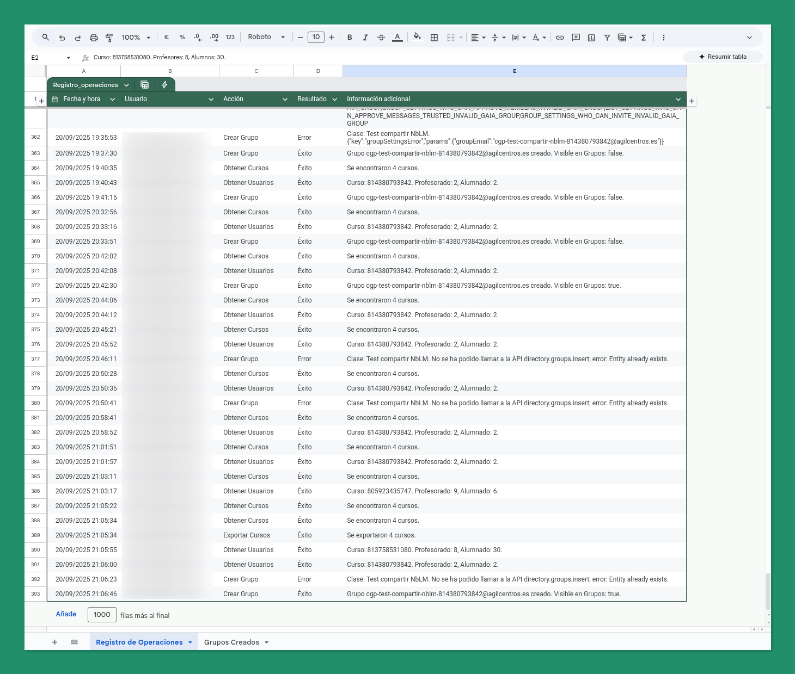
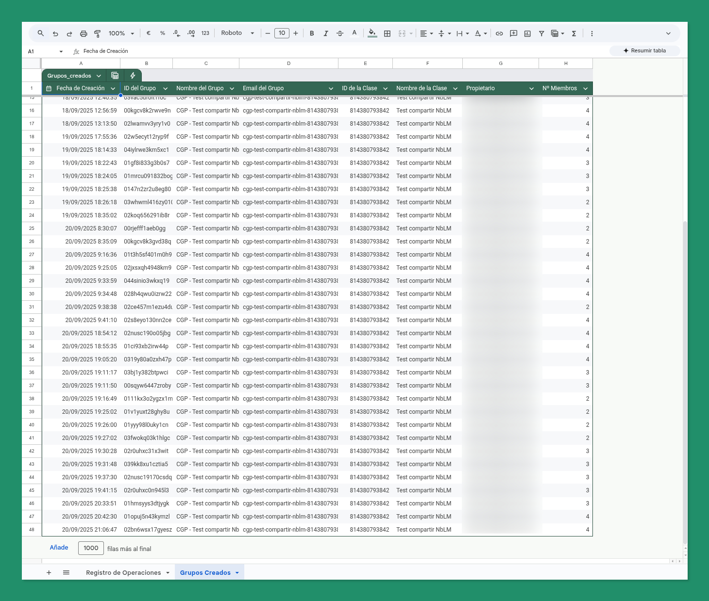

🇪🇸 [Versión en Español](README.md)

# Classroom Groups Proxy

## 1. Overview and purpose

**Classroom Groups Proxy** is a web application built on Google Apps Script that acts as a bridge between Google Classroom and Google Groups. Its main purpose is to allow teachers (or any user in the domain) to create and update Google Groups from their Google Classroom participants in a fast, secure, and controlled manner.

This tool addresses the need to interact with class members outside the confines of Google Classroom, facilitating actions such as:

*   **Easy Resource Sharing**: Email links to Gemini gems, NotebookLM notebooks, Drive files, or any other web resource to the entire class or just the teachers.
*   **Creating Communication Spaces**: Generate a Google Chat space from the new Google Group.
*   **Organizing Events**: Invite all class members to a Google Calendar event with a single email address.
*   **Establishing a Formal Communication Channel**: Use the group's mailing list as an official channel for important announcements.

The application functions as a "proxy" because it must be deployed by a **Super Administrator** of the Google Workspace domain. This way, the group creation process (an administrative task) is performed with the administrator's permissions, but the action is initiated by a non-privileged user (a teacher), who can only see and act upon their own classes.

## 2. Deployment and Usage

The deployment of this tool is a process that must be carried out by a **Super Administrator** of the Google Workspace domain.

### Deployment Steps

1.  **Get a copy of the template**: Access [this Google Sheets template](https://docs.google.com/spreadsheets/d/1tQZSeCweF1CPpYHStlQrWu1zJ-CYRg9phQLmsSlCFyE/edit?usp=sharing) and make a copy in your Google Drive. The sheet already contains the project code and the "Registro de Operaciones" and "Grupos Creados" tabs.
2.  **Open the Apps Script Editor**: Inside your copy of the spreadsheet, go to `Extensions > Apps Script`.
3.  **Deploy the Web Application**:
    *   Once in the editor, click the `Deploy` button and select `New deployment`.
    *   In the configuration window, adjust the following settings:
        *   **Description**: Give it a descriptive name, like "Classroom Groups Proxy".
        *   **Execute as**: `Me` (the email of the administrator performing the deployment).
        *   **Who has access**: `Anyone within [Your Domain]`.
    *   Click `Deploy`.
4.  **Authorize Permissions**: The first time you deploy, Google will ask you to authorize the permissions (OAuth scopes) that the script needs to function. Review and accept the permissions.
5.  **Get and Share the URL**: Once deployed, you will be provided with a web app URL. This is the URL you should share with teachers and other users in your domain so they can use the tool.

## 3. Detailed Features

The application's interface guides the user through a simple three-step process (click on the `EN` button on the top right corner of the screen to forcefully display the UI in English).

### Step 1: Course Selection

*   The application automatically detects the user and presents a dropdown menu with all the Google Classroom courses in which they are a teacher.
*   Upon selecting a course, the **automatic groups** that Classroom already creates by default (one for teachers and one for the whole class) are displayed, which may be sufficient for certain tasks like sharing files in Drive.

### Step 2: User Selection

*   Once a course is selected, the application loads two lists: **Teachers** and **Students**.
*   **Flexible Selection**:
    *   By default, all users in both lists are pre-selected.
    *   You can uncheck any user individually.
    *   You can use the "Select all" checkboxes to quickly check or uncheck all teachers or all students.
    *   The user creating the group (the teacher) is always included as the **owner** of the new group and cannot be deselected.

### Step 3: Group Configuration, Creation and Update

*   Before creating the group, you can adjust three key settings:
    1.  **Make teachers group managers**: If checked, all teachers in the course (except the owner) will get the "Manager" role in the group, allowing them to manage members and settings.
    2.  **Only owners and managers can send messages**: Restricts the ability to post in the group to only managers and owners. Very useful for one-way announcement groups.
    3.  **Make visible in Google Groups**: If enabled, the group will appear in the Google Groups directory and will keep an archive of all conversations sent to the mailing list.
*   When you click **"Create / Update Group"**, the backend handles the entire process. If the group already exists, the application will ask you if you want to update it. In that case, all existing members will be removed and the new selected ones will be added, and the configuration settings from the form will be applied. The group email is automatically generated with the format `cgp-[course-name]-[course-id]@[domain]`. It is important to note that this update process only affects the group members; the conversations and group history will not be affected.

    
    

### Other Features

*   **CSV Export**: At each step, there are buttons to export the list of courses or the list of users from the selected course to a CSV file.
*   **Activity Logging**: The spreadsheet hosting the script uses two tabs for activity logging. If these sheets do not exist, the script will create them on its first run:
    *   `Registro de Operaciones` (Operation Log): Saves a line for each action performed (loading courses, creating a group, errors, etc.), indicating who did it and when.
      

    *   `Grupos Creados` (Created Groups): Keeps a record of all groups that have been created with the tool.
      
*   **Internationalization (i18n)**: The interface is available in Spanish and English and automatically switches based on the user's browser language.

## 4. Detailed Technical Analysis

The project follows a simple client-server architecture, typical of Apps Script web applications.

*   `Code.gs`: This is the **backend** of the application.
    *   `doGet(e)`: The main entry point. It serves the `index.html` file when a user accesses the web app URL.
    *   `obtenerCursos()`, `obtenerUsuarios(idCurso)`: Functions that communicate with the **Google Classroom API** to get the necessary data.
    *   `crearGrupoDeClase(datosGrupo)`: The most complex function. It uses the **Admin SDK Directory API** to create the group and add members, and the **Admin SDK Groups Settings API** to apply the visibility and posting permission settings. It includes a retry mechanism with exponential backoff to verify that the group has propagated through Google's systems before attempting to add members. It also detects if a group already exists and, in that case, throws a specific error so the frontend can manage the update confirmation.
    *   `actualizarGrupoDeClase(datosGrupo)`: A function that handles updating an existing group. It removes all current members and adds the new ones, and applies the configuration settings from the form.
    *   `_logOperation(...)`, `_logGroupCreation(...)`: Internal functions for writing to the corresponding spreadsheets.
    *   `esUsuarioAdmin()`: Checks if the user who deployed the app is an administrator, a critical security check.

*   `index.html`: This is the **frontend structure**.
    *   A standard HTML file that uses **Bootstrap 5** for design and responsiveness.
    *   Defines all UI elements: selectors, lists, buttons, modals, etc.
    *   Includes the `main.html` file at the end to load the JavaScript logic.

*   `main.html`: Contains the **frontend logic** in JavaScript.
    *   Uses `document.addEventListener('DOMContentLoaded', ...)` to start the script once the page has loaded.
    *   Manages all interface events (clicks, changes in the selector, etc.).
    *   Communicates with the backend (`Code.gs`) asynchronously using `google.script.run`. This is the mechanism that allows a web page to execute Apps Script functions.
    *   Handles the internationalization (i18n) logic, changing the interface texts according to the selected language.

*   `appsscript.json`: This is the **project manifest**. A vital JSON configuration file.
    *   `timeZone`: Defines the project's time zone.
    *   `dependencies`: Declares the advanced Google services that the script will use (Classroom, AdminDirectory, GroupsSettings).
    *   `webapp`: Configures the execution mode of the web app. `"executeAs": "USER_DEPLOYING"` is the key to the "proxy" model.
    *   `oauthScopes`: Lists all the permissions the script needs to function. The user (the administrator) must authorize these permissions during deployment.

## 5. License

This project is licensed under the **[GNU General Public License v3.0 (GNU GPL v3)](LICENSE)**.

## 6. Credits

This project has been created and is maintained by [Pablo Felip](https://www.linkedin.com/in/pfelipm/).
