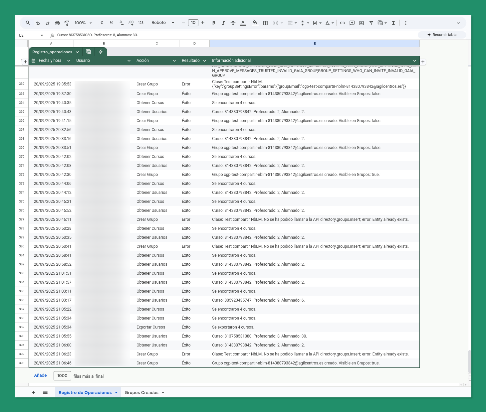
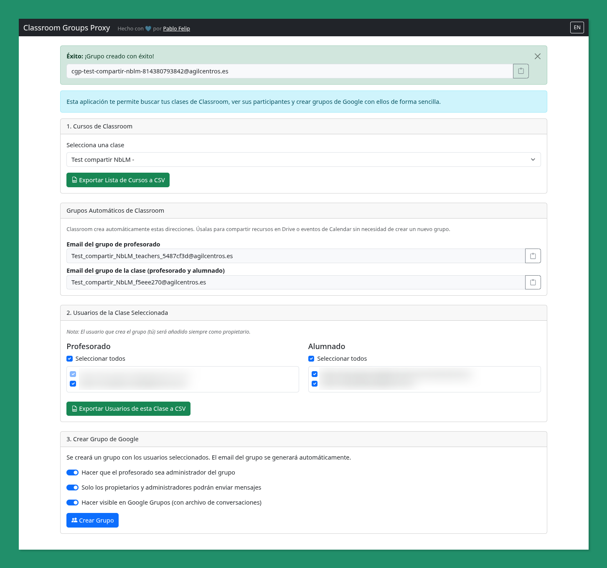

🇬🇧 [English Version](README.en.md)

# Classroom Groups Proxy

## 1. Qué es y para qué sirve

**Classroom Groups Proxy** es una aplicación web desarrollada en Google Apps Script que sirve como un puente entre Google Classroom y Google Groups. Su principal objetivo es permitir al profesorado (o a cualquier usuario del dominio) crear Grupos de Google a partir de los participantes de sus cursos de Classroom de una manera rápida, segura y controlada.

Esta herramienta soluciona la necesidad de interactuar con los miembros de una clase fuera de los límites de Google Classroom, facilitando acciones como:

*   **Compartir recursos fácilmente**: Enviar por correo enlaces a gems de Gemini, cuadernos de NotebookLM, archivos de Drive o cualquier otro recurso web a toda la clase o solo al profesorado.
*   **Crear espacios de comunicación**: Generar un grupo de chat en Google Chat a partir del nuevo grupo de Google.
*   **Organizar eventos**: Invitar a todos los miembros de la clase a un evento en Google Calendar con una sola dirección de correo.
*   **Establecer un canal de comunicación formal**: Utilizar la lista de correo del grupo como un canal oficial para anuncios importantes.

La aplicación funciona como un "proxy" porque debe ser desplegada por un **Super Administrador** del dominio de Google Workspace. De este modo, la creación de grupos (una tarea administrativa) se realiza con los permisos del administrador, pero la acción es iniciada por un usuario sin privilegios (un profesor), que solo puede ver y actuar sobre sus propias clases.

## 2. Obtención, Despliegue y Uso

El despliegue de esta herramienta es un proceso que debe realizar un **Super Administrador** del dominio de Google Workspace.

### Pasos para el Despliegue

1.  **Obtener una copia de la plantilla**: Accede a [ESTA PLANTILLA DE GOOGLE SHEETS](https://docs.google.com/spreadsheets/d/{ID_ARCHIVO}/copy) y haz una copia en tu Google Drive. La hoja ya contiene el código del proyecto y las pestañas "Registro de Operaciones" y "Grupos Creados".

2.  **Abrir el Editor de Apps Script**: Dentro de tu copia de la hoja de cálculo, ve a `Extensiones > Apps Script`.
3.  **Desplegar la Aplicación Web**:
    *   Una vez en el editor, haz clic en el botón `Desplegar` y selecciona `Nuevo despliegue`.
    *   En la ventana de configuración, ajusta las siguientes opciones:
        *   **Descripción**: Dale un nombre descriptivo, como "Classroom Groups Proxy".
        *   **Ejecutar como**: `Yo` (el correo del administrador que está realizando el despliegue).
        *   **Quién tiene acceso**: `Cualquier usuario del dominio [Tu Dominio]`.
    *   Haz clic en `Desplegar`.
5.  **Autorizar los Permisos**: La primera vez que despliegues, Google te pedirá que autorices los permisos (scopes de OAuth) que el script necesita para funcionar. Revisa y acepta los permisos.
6.  **Obtener y Compartir la URL**: Una vez desplegada, se te proporcionará una URL de la aplicación web. Esta es la URL que debes compartir con los profesores y otros usuarios de tu dominio para que puedan utilizar la herramienta.

## 3. Funcionalidades Detalladas

La interfaz de la aplicación guía al usuario a través de un proceso sencillo de tres pasos.

### Paso 1: Selección del Curso

*   La aplicación detecta automáticamente el usuario que la está utilizando y le presenta un menú desplegable con todos los cursos de Google Classroom en los que es profesor.
*   Al seleccionar un curso, se muestran los **grupos automáticos** que Classroom ya crea por defecto (uno para el profesorado y otro para toda la clase), que pueden ser suficientes para ciertas tareas como compartir archivos en Drive.

### Paso 2: Selección de Usuarios

*   Una vez seleccionado un curso, la aplicación carga dos listas: **Profesorado** y **Alumnado**.
*   **Selección flexible**:
    *   Por defecto, todos los usuarios de ambas listas están preseleccionados.
    *   Puedes desmarcar a cualquier usuario individualmente.
    *   Puedes usar los checkboxes "Seleccionar todos" para marcar o desmarcar rápidamente a todo el profesorado o a todo el alumnado.
    *   El usuario que está creando el grupo (el profesor) siempre se incluye como **propietario** del nuevo grupo y no puede ser deseleccionado.

### Paso 3: Configuración y Creación del Grupo

*   Antes de crear el grupo, puedes ajustar tres configuraciones clave:
    1.  **Hacer que el profesorado sea administrador del grupo**: Si está marcada, todo el profesorado del curso (excepto el propietario) obtendrán el rol de "Manager" en el grupo, permitiéndoles gestionar miembros y ajustes.
    2.  **Solo los propietarios y administradores podrán enviar mensajes**: Restringe la capacidad de publicar en el grupo solo a los managers y propietarios. Muy útil para grupos unidireccionales de anuncios.
    3.  **Hacer visible en Google Grupos**: Si se activa, el grupo aparecerá en el directorio de Google Groups y guardará un archivo de todas las conversaciones enviadas a la lista de correo.
*   Al hacer clic en **"Crear Grupo"**, el backend se encarga de todo el proceso. El email del grupo se genera automáticamente con el formato `cgp-[nombre-del-curso]-[id-del-curso]@[dominio]`.

### Otras Funcionalidades

*   **Exportación a CSV**: En cada paso, hay botones para exportar la lista de cursos o la lista de usuarios del curso seleccionado a un fichero CSV.
*   **Registro de Actividad**: La hoja de cálculo que aloja el script utiliza dos pestañas para el registro de actividad. Si estas no existen, el código las creará en la primera ejecución:
    *   `Registro de Operaciones`: Guarda una línea por cada acción realizada (carga de cursos, creación de grupo, errores, etc.), indicando quién la hizo y cuándo.
      
    *   `Grupos Creados`: Mantiene un registro de todos los grupos que se han creado con la herramienta.
      

*   **Internacionalización (i18n)**: La interfaz está disponible en español e inglés y cambia automáticamente según el idioma del navegador del usuario.

## 4. Análisis Técnico Detallado

El proyecto sigue una arquitectura cliente-servidor simple, típica de las aplicaciones web de Apps Script.

*   `Code.gs`: Es el **backend** de la aplicación.
    *   `doGet(e)`: Es el punto de entrada principal. Sirve el fichero `index.html` cuando un usuario accede a la URL de la aplicación.
    *   `obtenerCursos()`, `obtenerUsuarios(idCurso)`: Funciones que se comunican con la **API de Google Classroom** para obtener los datos necesarios.
    *   `crearGrupoDeClase(datosGrupo)`: La función más compleja. Utiliza la **API Admin SDK Directory** para crear el grupo y añadir los miembros, y la **API Admin SDK Groups Settings** para aplicar la configuración de visibilidad y permisos de publicación. Incluye un mecanismo de reintentos con backoff exponencial para verificar que el grupo se ha propagado por los sistemas de Google antes de intentar añadir miembros.
    *   `_logOperation(...)`, `_logGroupCreation(...)`: Funciones internas para escribir en las hojas de cálculo correspondientes.
    *   `esUsuarioAdmin()`: Comprueba si el usuario que desplegó la app es administrador, una comprobación de seguridad crítica.

*   `index.html`: Es la **estructura del frontend**.
    *   Un fichero HTML estándar que utiliza **Bootstrap 5** para el diseño y la responsividad.
    *   Define todos los elementos de la interfaz: selectores, listas, botones, modales, etc.
    *   Incluye el fichero `main.html` al final para cargar la lógica de JavaScript.

*   `main.html`: Contiene la **lógica del frontend** en JavaScript.
    *   Utiliza `document.addEventListener('DOMContentLoaded', ...)` para iniciar el script una vez que la página ha cargado.
    *   Gestiona todos los eventos de la interfaz (clics, cambios en el selector, etc.).
    *   Se comunica con el backend (`Code.gs`) de forma asíncrona usando `google.script.run`. Este es el mecanismo que permite a una página web ejecutar funciones de Apps Script.
    *   Maneja la lógica de internacionalización (i18n), cambiando los textos de la interfaz según el idioma seleccionado.

*   `appsscript.json`: Es el **manifiesto del proyecto**. Un fichero de configuración JSON vital.
    *   `timeZone`: Define la zona horaria del proyecto.
    *   `dependencies`: Declara los servicios avanzados de Google que el script utilizará (Classroom, AdminDirectory, GroupsSettings).
    *   `webapp`: Configura el modo de ejecución de la aplicación web. `"executeAs": "USER_DEPLOYING"` es la clave del modelo de "proxy".
    *   `oauthScopes`: Enumera todos los permisos que el script necesita para funcionar. El usuario (el administrador) debe autorizar estos permisos durante el despliegue.

## 5. Licencia

Este proyecto se distribuye bajo las condiciones y términos de la **[Licencia Pública General de GNU v3.0 (GNU GPL v3)](LICENSE)**.

## 6. Créditos

Este proyecto ha sido creado y es mantenido por [Pablo Felip](https://www.linkedin.com/in/pfelipm/).
